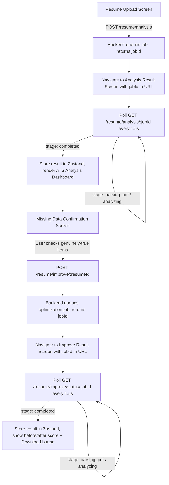

# ResumePilot — Frontend

React frontend for ResumePilot, an AI-powered resume ATS analyzer and optimizer. Upload a resume, get an ATS score and gap analysis, confirm which improvements genuinely apply, and download an AI-optimized version — all backed by an async job pipeline with live progress polling.

> Backend repo: `resumepilot-backend` (link it here once published)

---

## Table of Contents

- [Overview](#overview)
- [Features](#features)
- [Tech Stack](#tech-stack)
- [App Flow](#app-flow)
- [How Polling Works](#how-polling-works)
- [Project Structure](#project-structure)
- [Getting Started](#getting-started)
- [Environment Variables](#environment-variables)
- [Roadmap](#roadmap)

---

## Overview

The backend processes resume analysis and optimization as background jobs (they can take 10–30 seconds), so the frontend never blocks on a single long-running request. Instead, each screen that depends on AI-generated results polls a status endpoint every ~1.5 seconds and progressively updates the UI — upload → live progress → final result — the same pattern used by tools like Midjourney.

---

## Features

- 📤 **Resume Upload** — PDF upload with target role and job description input
- 📊 **ATS Analysis Dashboard** — overall score, keyword match, formatting score, section-by-section breakdown (Contact Info, Education, Experience, Projects)
- ✅ **Missing Data Confirmation Screen** — only user-confirmed missing keywords/improvements are ever sent for optimization; nothing is added automatically
- ⏳ **Live Progress Polling** — real-time stage updates (parsing → analyzing/optimizing → completed) without a generic spinner
- 📄 **Optimized Resume Result** — before/after ATS score comparison, applied improvements list, and a downloadable PDF
- 🔐 **JWT-authenticated routes**
- 🗂️ **Zustand global state** — analysis results and optimization results persist across screens without prop-drilling

---

## Tech Stack

| Layer | Technology |
|---|---|
| Framework | React |
| Routing | React Router |
| State Management | Zustand |
| Styling | Tailwind CSS |
| HTTP Client | Axios |
| Notifications | react-hot-toast |

---

## App Flow



---

## How Polling Works

Each result screen (Analysis, Optimization) follows the same pattern:

1. Read a `jobId` from the URL params (not from navigation `state`, so the screen survives a page refresh)
2. If the relevant data isn't already in the Zustand store, start polling the status endpoint on an interval
3. On every poll response, read `stage` (`queued` / `parsing_pdf` / `analyzing` / `completed` / `failed`) and update the loading UI accordingly
4. On `completed`, save the result into Zustand and stop polling (`clearInterval`)
5. On `failed`, show an error toast and stop polling

**Note:** Zustand state only lives in memory — on a hard page refresh, `analysis`/`improvedResult` reset to `null`. Because the `jobId` is always in the URL, the polling `useEffect` re-fetches from the backend automatically rather than relying on stale client state.

---

## Project Structure

```
src/
├── Pages/
│   ├── Resume-Upload/
│   ├── Resume-Analytics/       # ATS analysis dashboard
│   └── Improve-Resume/           # Confirmation + optimized result screens
├── components/
│   ├── Layout/                    # PageWrapper, GlassCard, PageTransition
│   └── Button/
├── Store/
│   └── ResumeStore.js            # Zustand store (analysis, improvedResult)
├── services/
│   └── api.js                       # Axios instance + get/post/put/del helpers
└── styles/
    ├── Color.js
    └── Font.js
```

---

## Getting Started

### Prerequisites
- Node.js 18+
- Backend API running (see backend repo)

### Setup

```bash
npm install
npm run dev
```

---

## Environment Variables

```env
VITE_API_URL=http://localhost:<backend-port>
```

---

## Roadmap

- [ ] Voice-based mock interview UI (record answer → live transcription progress → AI audio response)
- [ ] Job portal screens (candidate/recruiter/admin views)
- [ ] Resume version history view

---

## License

This project is currently private/personal. License terms to be added.
